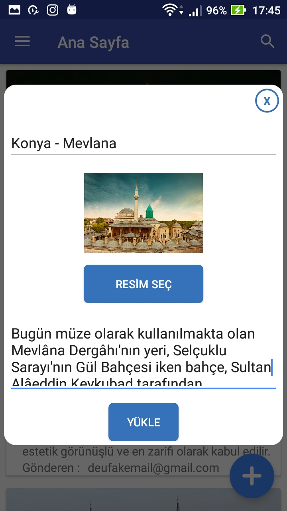
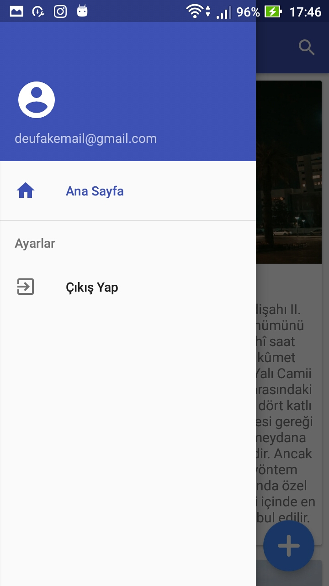

# GeziApp

## About The Project

This mobile application project is an Android application developed using the Java language. Users can register on this application and share their experiences of various places they visit with other users. The application allows users to add photos of the places they visit and share these photos with other users. Consequently, users can share their experiences with each other, discover different places, and gather impressions from their travels all in one place.

 
 
  
 

## Used Libraries

- firebase-auth
- firebase-database
- firebase-storage
